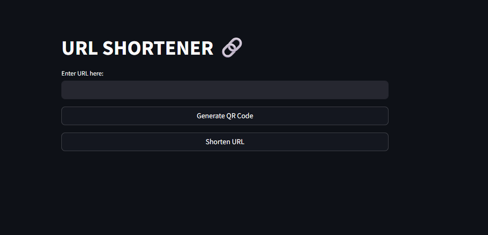

# URL Shortener

<p align="center">
  
</p>

This project is a **URL shortener** that aims to help users shorten long URLs into more manageable links.

## Purpose

The goal of this project was primarily to:
- Learn and implement Python code formatting using tools like **Black** and **flake8**.
- Configure and use **pre-commit** hooks for automating code checks before committing.
- Set up **GitHub Actions workflows** for automating testing, linting, and other tasks.
- Understand the basics of creating a **Dockerfile** and containerizing the application for easy deployment.

## Technologies Used
- **Python** for backend functionality
- **Black** for code formatting
- **flake8** for linting
- **pre-commit** for pre-commit hooks
- **Docker** for containerization
- **GitHub Actions** for CI/CD automation

## Features
- Shortens long URLs into a small, shareable format
- Create QR code of URL links
- Ensures code quality with automatic formatting and linting
- Automates testing and linting through GitHub Actions workflows
- Containerized application using Docker for consistent environments

## How to Use

1. **Clone the repository**:
   ```bash
   git clone https://github.com/HamzaSulaiman1996/url-shortener.git
   cd url-shortener
2. **Setup pre-commit hooks**:
   ```bash
   pip install pre-commit
   pre-commit install
3. **Install dependencies**:
    ```bash
    pip install -r requirements.txt
4. **Run locally**:
   ```bash
   streamlit run app.py

## Run using Docker
1. **Build Docker image**:
   ```bash
   docker build -t {TAG} .
2. **Run Docker image**:
   ```bash
   docker run -d -p 8501:8501 --name {CONTAINER-NAME} {TAG}
